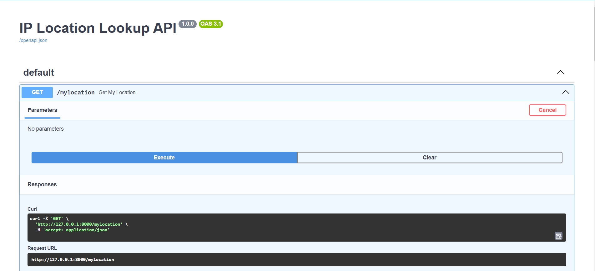
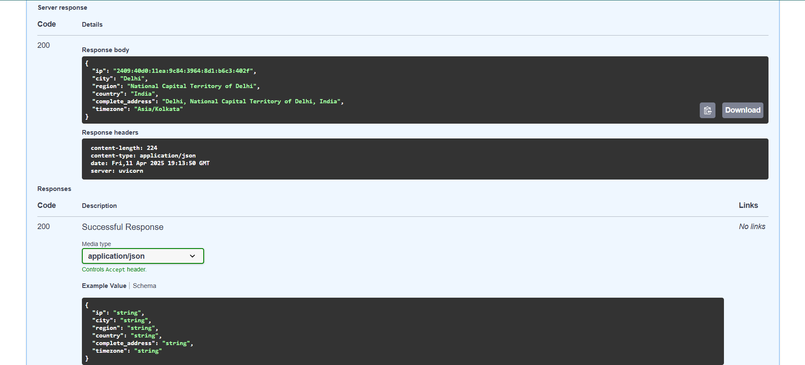
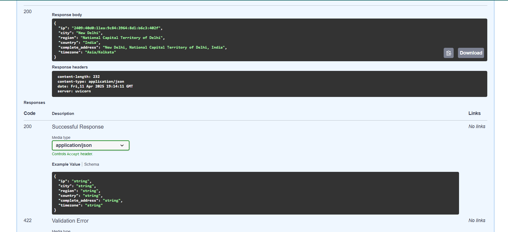
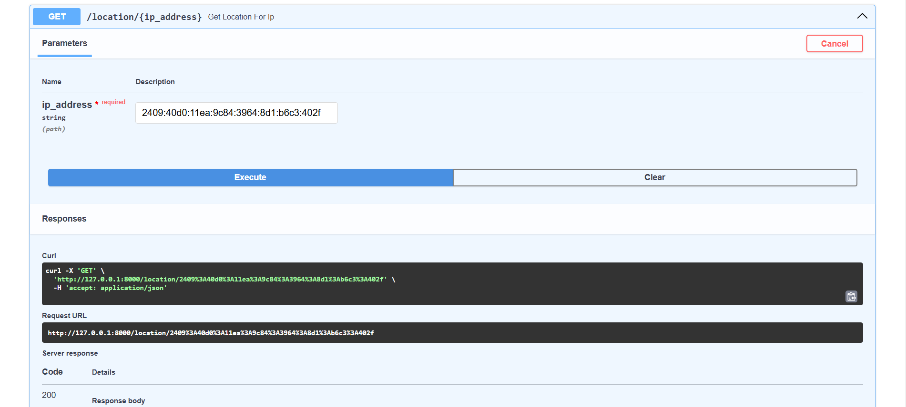
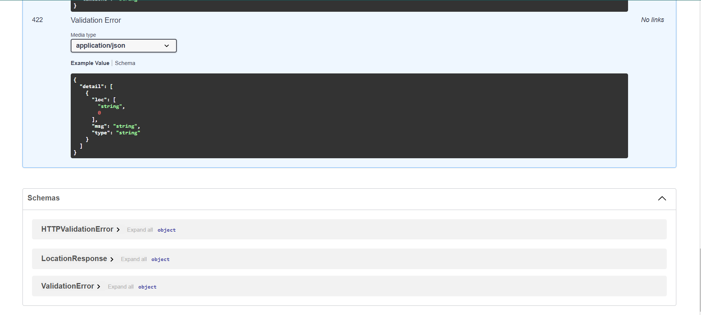

# IP Location Lookup API

A FastAPI web service that performs IP address location lookups.

## Demo

### GIF Demonstration


### Screenshots

#### Getting Your Current Location



#### Looking Up Specific IP Addresses




## Features

1. Retrieves the current IP address using trackip.net API
2. Looks up geolocation data using ipapi.co API 
   - With automatic fallback if rate limited
3. Returns the complete address with country, city, region, and timezone information
4. Provides a RESTful API with well-documented endpoints

## Requirements

- Python 3.12 or higher
- Required libraries (see requirements.txt):
  - requests
  - fastapi
  - uvicorn

## Installation

Install the required dependencies:
```bash
pip install -r requirements.txt

